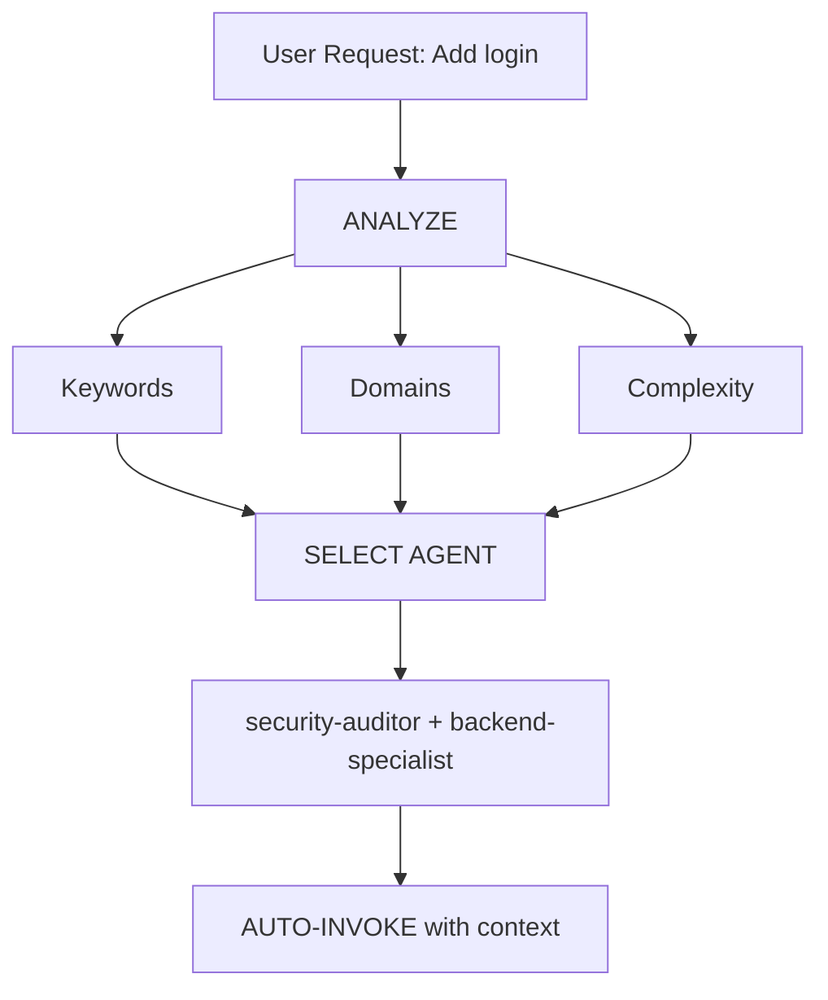

# Intelligent Agent Routing

**Purpose**: Automatically analyze user requests and route them to the most appropriate specialist agent(s) without requiring explicit user mentions.

## Core Principle

> **The AI should act as an intelligent Project Manager**, analyzing each request and automatically selecting the best specialist(s) for the job.

## How It Works

### 1. Request Analysis

Before responding to ANY user request, perform automatic analysis:



### 2. Auto-Discovery Search Protocol (1300+ Skills)

**Do NOT rely on a static matrix because there are over 1300 skills in the `.agent/skills/` directory.**

Instead, use a Keyword-Based Search Protocol to automatically find the right skill:

| User Intent Example | Keywords Triggered | Search Query Example | Auto-invoke? |
| ------------------- | ------------------ | -------------------- | ------------ |
| **Authentication**  | login, auth, signup| `find .agent/skills -name '*auth*' -o -name '*login*'` | ✅ YES |
| **SEO Audit**       | seo, rank, meta    | `find .agent/skills -name '*seo*'` | ✅ YES |
| **Mobile UI**       | react native, mobile| `find .agent/skills -name '*mobile*'` | ✅ YES |
| **AWS Deployment**  | aws, deploy, serverless | `find .agent/skills -name '*aws*'` | ✅ YES |
| **Bug Fix**         | error, stack trace | `find .agent/skills -name '*debug*'` | ✅ YES (or Auto-Recover) |

### 3. Vibe Coding Workflow Integration (Skill Chaining)

For non-programmers asking to build a feature or an app from scratch (Complex Task):
**NEVER jump straight to code.**

1. **Auto-invoke: `vibe-prd`** (Create product specification naturally)
2. **Auto-invoke: `vibe-techdesign`** (Map architecture silently)
3. **Auto-invoke: Developer skill** (Generate code using the discovered specialized framework skill)

## TIER 0 - Auto-Discovery Engine (ALWAYS ACTIVE)

Before responding to ANY request:

```javascript
// Pseudo-code for decision tree
function analyzeAndRoute(userMessage) {
    // 1. Detect domain keywords from message
    const keywords = extractKeywords(userMessage);

    // 2. Search local directory for matching skill
    const matchedSkills = searchLocalSkillsDirectory(keywords);

    // 3. Select best skill
    const bestSkill = selectBestMatch(matchedSkills);

    // 4. If Complex feature building -> USE SKILL CHAINING
    if (isNewFeatureBuild(userMessage)) {
        chainSkills(["vibe-prd", "vibe-techdesign", bestSkill]);
    } else {
        invokeSkill(bestSkill);
    }
}
```

## 4. Response Format

**When auto-selecting a skill from the 1300+ library, inform the user concisely:**

```markdown
🤖 **Auto-Discovery: Mendeteksi dan mengaktifkan skill `@[nama-skill-yg-ditemukan]`...**

[Proceed with specialized response]
```

**Benefits for Vibe Coding:**

- ✅ User doesn't need to memorize 1300+ skill names.
- ✅ Transparent decision-making.
- ✅ AI naturally shifts personas.

### Single-Domain Tasks (Auto-invoke Single Agent)

| Domain          | Patterns                                   | Agent                   |
| --------------- | ------------------------------------------ | ----------------------- |
| **Security**    | auth, login, jwt, password, hash, token    | `security-auditor`      |
| **Frontend**    | component, react, vue, css, html, tailwind | `frontend-specialist`   |
| **Backend**     | api, server, express, fastapi, node        | `backend-specialist`    |
| **Mobile**      | react native, flutter, ios, android, expo  | `mobile-developer`      |
| **Database**    | prisma, sql, mongodb, schema, migration    | `database-architect`    |
| **Testing**     | test, jest, vitest, playwright, cypress    | `test-engineer`         |
| **DevOps**      | docker, kubernetes, ci/cd, pm2, nginx      | `devops-engineer`       |
| **Debug**       | error, bug, crash, not working, issue      | `debugger`              |
| **Performance** | slow, lag, optimize, cache, performance    | `performance-optimizer` |
| **SEO**         | seo, meta, analytics, sitemap, robots      | `seo-specialist`        |
| **Game**        | unity, godot, phaser, game, multiplayer    | `game-developer`        |

### Multi-Domain Tasks (Auto-invoke Orchestrator)

If request matches **2+ domains from different categories**, automatically use `orchestrator`:

```text
Example: "Create a secure login system with dark mode UI"
→ Detected: Security + Frontend
→ Auto-invoke: orchestrator
→ Orchestrator will handle: security-auditor, frontend-specialist, test-engineer
```

## Complexity Assessment

### SIMPLE (Direct agent invocation)

- Single file edit
- Clear, specific task
- One domain only
- Example: "Fix the login button style"

**Action**: Auto-invoke respective agent

### MODERATE (2-3 agents)

- 2-3 files affected
- Clear requirements
- 2 domains max
- Example: "Add API endpoint for user profile"

**Action**: Auto-invoke relevant agents sequentially

### COMPLEX (Orchestrator required)

- Multiple files/domains
- Architectural decisions needed
- Unclear requirements
- Example: "Build a social media app"

**Action**: Auto-invoke `orchestrator` → will ask Socratic questions

## Implementation Rules

### Rule 1: Silent Analysis

#### DO NOT announce "I'm analyzing your request..."

- ✅ Analyze silently
- ✅ Inform which agent is being applied
- ❌ Avoid verbose meta-commentary

### Rule 2: Inform Agent Selection

**DO inform which expertise is being applied:**

```markdown
🤖 **Applying knowledge of `@frontend-specialist`...**

I will create the component with the following characteristics:
[Continue with specialized response]
```

### Rule 3: Seamless Experience

**The user should not notice a difference from talking to the right specialist directly.**

### Rule 4: Override Capability

**User can still explicitly mention agents:**

```text
User: "Use @backend-specialist to review this"
→ Override auto-selection
→ Use explicitly mentioned agent
```

## Edge Cases

### Case 1: Generic Question

```text
User: "How does React work?"
→ Type: QUESTION
→ No agent needed
→ Respond directly with explanation
```

### Case 2: Extremely Vague Request

```text
User: "Make it better"
→ Complexity: UNCLEAR
→ Action: Ask clarifying questions first
→ Then route to appropriate agent
```

### Case 3: Contradictory Patterns

```text
User: "Add mobile support to the web app"
→ Conflict: mobile vs web
→ Action: Ask: "Do you want responsive web or native mobile app?"
→ Then route accordingly
```

## Integration with Existing Workflows

### With /orchestrate Command

- **User types `/orchestrate`**: Explicit orchestration mode
- **AI detects complex task**: Auto-invoke orchestrator (same result)

**Difference**: User doesn't need to know the command exists.

### With Socratic Gate

- **Auto-routing does NOT bypass Socratic Gate**
- If task is unclear, still ask questions first
- Then route to appropriate agent

### With GEMINI.md Rules

- **Priority**: GEMINI.md rules > intelligent-routing
- If GEMINI.md specifies explicit routing, follow it
- Intelligent routing is the DEFAULT when no explicit rule exists

## Testing the System

### Test Cases

#### Test 1: Simple Frontend Task

```text
User: "Create a dark mode toggle button"
Expected: Auto-invoke frontend-specialist
Verify: Response shows "Using @frontend-specialist"
```

#### Test 2: Security Task

```text
User: "Review the authentication flow for vulnerabilities"
Expected: Auto-invoke security-auditor
Verify: Security-focused analysis
```

#### Test 3: Complex Multi-Domain

```text
User: "Build a chat application with real-time notifications"
Expected: Auto-invoke orchestrator
Verify: Multiple agents coordinated (backend, frontend, test)
```

#### Test 4: Bug Fix

```text
User: "Login is not working, getting 401 error"
Expected: Auto-invoke debugger
Verify: Systematic debugging approach
```

## Performance Considerations

### Token Usage

- Analysis adds ~50-100 tokens per request
- Tradeoff: Better accuracy vs slight overhead
- Overall SAVES tokens by reducing back-and-forth

### Response Time

- Analysis is instant (pattern matching)
- No additional API calls required
- Agent selection happens before first response

## User Education

### Optional: First-Time Explanation

If this is the first interaction in a project:

```markdown
💡 **Tip**: I am configured with automatic specialist agent selection.
I will always choose the most suitable specialist for your task. You can
still mention agents explicitly with `@agent-name` if you prefer.
```

## Debugging Agent Selection

### Enable Debug Mode (for development)

Add to GEMINI.md temporarily:

```markdown
## DEBUG: Intelligent Routing

Show selection reasoning:

- Detected domains: [list]
- Selected agent: [name]
- Reasoning: [why]
```

## Summary

**intelligent-routing skill enables:**

✅ Zero-command operation (no need for `/orchestrate`)  
✅ Automatic specialist selection based on request analysis  
✅ Transparent communication of which expertise is being applied  
✅ Seamless integration with existing workflows  
✅ Override capability for explicit agent mentions  
✅ Fallback to orchestrator for complex tasks

**Result**: User gets specialist-level responses without needing to know the system architecture.

---

**Next Steps**: Integrate this skill into GEMINI.md TIER 0 rules.
