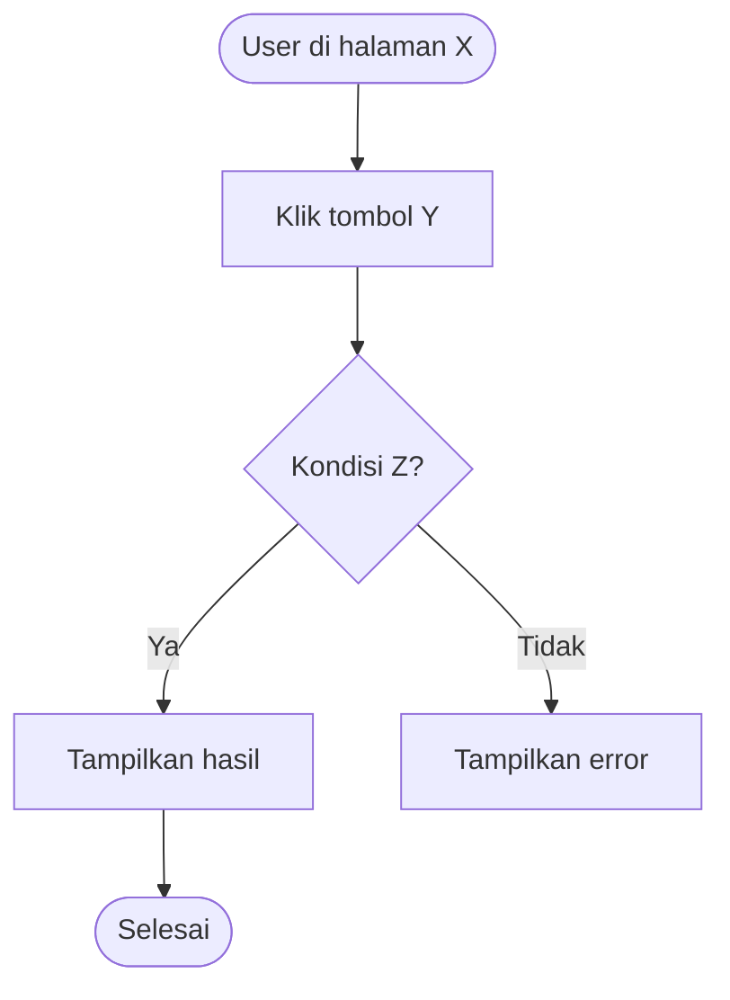

# specs/ — Feature Spec Files

Folder ini berisi spec per fitur **sebelum** AI mulai coding.
Konsep: "blueprint dulu, coding belakangan" — AI punya konteks yang terfokus dan tidak akan salah arah.

---

## Kapan Perlu Buat Spec?

| Ukuran Fitur | Perlu Spec? |
|---|---|
| XS / S (< 3 jam, 1-2 file) | Tidak perlu — langsung bilang ke AI |
| M (3–6 jam, 3–5 file) | Ya — buat spec singkat |
| L / XL (> 6 jam, 6+ file) | Wajib — spec detail termasuk wireframe |

---

## Format File

Nama file: `NNN-nama-fitur.md`
Contoh: `001-checkout.md`, `002-profile-edit.md`

---

## Template Spec

```markdown
# [NNN] Nama Fitur

**Status:** Draft / Ready / In Progress / Done
**Sprint:** [nomor sprint]
**Assignee:** [nama atau "AI"]
**Estimasi:** S / M / L / XL
**Terkait:** [REQ-XXX dari 01-PRD.md]

---

## Tujuan

[1–2 kalimat: masalah user apa yang diselesaikan fitur ini]

---

## User Flow Fitur Ini



---

## Wireframe (Text-based)

> Gambarkan layout tiap halaman/state dalam format ASCII atau deskripsi posisi.
> Untuk desain detail: tambahkan URL Figma di bagian bawah.

### State: Normal (data ada)

```
┌─────────────────────────────────────┐
│  [Header / Navbar]                  │
├─────────────────────────────────────┤
│  Judul Halaman                      │
│                                     │
│  ┌──────────┐  ┌──────────────────┐ │
│  │ [Filter] │  │ [Tombol Tambah]  │ │
│  └──────────┘  └──────────────────┘ │
│                                     │
│  ┌─────────────────────────────────┐│
│  │ Item 1        [Edit] [Hapus]   ││
│  ├─────────────────────────────────┤│
│  │ Item 2        [Edit] [Hapus]   ││
│  └─────────────────────────────────┘│
└─────────────────────────────────────┘
```

### State: Loading

```
┌─────────────────────────────────────┐
│  [Header / Navbar]                  │
├─────────────────────────────────────┤
│  ░░░░░░░░░░░░░░  (skeleton)         │
│  ░░░░░░░░░░░░░░░░░░░░░              │
│  ░░░░░░░░░░░░░░░░░░░░░░░░░          │
└─────────────────────────────────────┘
```

### State: Kosong (belum ada data)

```
┌─────────────────────────────────────┐
│  [Header / Navbar]                  │
├─────────────────────────────────────┤
│                                     │
│          📭                         │
│    Belum ada [item]                 │
│  Mulai dengan menambahkan yang      │
│  pertama                            │
│                                     │
│       [Tambah Item]                 │
│                                     │
└─────────────────────────────────────┘
```

### State: Error

```
┌─────────────────────────────────────┐
│  ⚠️  Gagal memuat data              │
│     [Coba Lagi]                     │
└─────────────────────────────────────┘
```

Figma: [URL jika ada — dibaca via Figma MCP]

---

## Acceptance Criteria (BDD — Given/When/Then)

> Format: **Given** (kondisi awal) → **When** (aksi user) → **Then** (hasil yang diharapkan).
> Setiap scenario di sini langsung bisa dikonversi ke Playwright E2E test oleh AI.

### Scenario 1: [nama skenario — contoh: Login berhasil]
```
Given  user sudah punya akun dengan email "user@mail.com"
  And  user berada di halaman login
When   user mengisi email dan password yang benar, lalu klik "Masuk"
Then   user diarahkan ke halaman dashboard
  And  session tersimpan — user tidak perlu login ulang dalam 7 hari
```

### Scenario 2: [nama skenario — contoh: Login gagal karena password salah]
```
Given  user sudah punya akun
  And  user berada di halaman login
When   user mengisi password yang salah, lalu klik "Masuk"
Then   muncul pesan error: "Email atau password salah"
  And  user tetap di halaman login
  And  password field dikosongkan
```

### Scenario 3: [nama skenario — contoh: Validasi form]
```
Given  user berada di halaman [X]
When   user klik [tombol submit] tanpa mengisi [field wajib]
Then   muncul pesan error di bawah field: "[nama field] wajib diisi"
  And  form tidak terkirim
```

### Scenario 4: [nama skenario — contoh: Empty state]
```
Given  user belum punya data apapun
When   user membuka halaman [X]
Then   tampil ilustrasi dan teks "Belum ada [item]"
  And  ada tombol "[Tambah Item]"
```

> **Checklist ringkas (untuk QA manual):**
> - [ ] Scenario 1 lulus
> - [ ] Scenario 2 lulus
> - [ ] Scenario 3 lulus
> - [ ] Scenario 4 lulus
> - [ ] Loading state tampil saat data sedang diambil
> - [ ] Error state tampil jika API gagal + ada tombol "Coba Lagi"

---

## API / Data yang Dibutuhkan

| Method | Endpoint | Keterangan |
|--------|----------|------------|
| GET | `/api/[resource]` | Ambil daftar, pagination wajib |
| POST | `/api/[resource]` | Tambah data baru |
| PATCH | `/api/[resource]/[id]` | Update parsial |
| DELETE | `/api/[resource]/[id]` | Soft delete |

**Request body (POST):**
```typescript
{
  field1: string   // wajib
  field2?: number  // opsional
}
```

**Response sukses:**
```typescript
{ success: true, data: { id: string, ... } }
```

**Response error:**
```typescript
{ success: false, error: "Pesan error untuk user" }
```

---

## Perubahan Database (jika ada)

```prisma
// Tabel baru atau perubahan schema
model [NamaModel] {
  id        String   @id @default(cuid())
  // ...
  createdAt DateTime @default(now())
  updatedAt DateTime @updatedAt
  deletedAt DateTime?
  @@map("[nama_tabel]")
}
```

---

## File yang Akan Diubah

- `app/[path]/page.tsx` — halaman utama fitur
- `app/api/[resource]/route.ts` — API endpoint
- `lib/[modul]/index.ts` — business logic
- `prisma/schema.prisma` — jika ada perubahan DB

---

## Constraint

- Jangan ubah: [komponen/file yang tidak boleh disentuh]
- Dependensi: [fitur lain yang harus selesai lebih dulu]
- Performa: [target waktu load, batas ukuran data, dll]

---

## Catatan

[Hal-hal penting lainnya, edge case, atau keputusan yang perlu konfirmasi]
```

---

## Cara Pakai

**Buat spec baru:**
```
Ketik /new-feature → AI tanya nama fitur → AI generate spec ini
```

**Gunakan spec saat coding:**
```
Baca specs/001-checkout.md lalu implementasikan.
Jangan ubah file selain yang ada di "File yang Akan Diubah".
```

**Update status:**
- Saat mulai: `Status: In Progress`
- Saat selesai: `Status: Done` + centang semua Acceptance Criteria

**Generate E2E test dari BDD scenario:**
```
Baca specs/001-checkout.md bagian Acceptance Criteria,
lalu buat Playwright test untuk setiap scenario Given/When/Then.
Simpan di: tests/e2e/[nama-fitur].spec.ts
```

**Contoh output Playwright dari BDD:**
```typescript
// tests/e2e/login.spec.ts
import { test, expect } from '@playwright/test'

// Scenario 1: Login berhasil
test('login berhasil dengan kredensial valid', async ({ page }) => {
  // Given
  await page.goto('/login')

  // When
  await page.fill('[name="email"]', 'user@mail.com')
  await page.fill('[name="password"]', 'password123')
  await page.click('button[type="submit"]')

  // Then
  await expect(page).toHaveURL('/dashboard')
})

// Scenario 2: Login gagal password salah
test('tampil error saat password salah', async ({ page }) => {
  // Given
  await page.goto('/login')

  // When
  await page.fill('[name="email"]', 'user@mail.com')
  await page.fill('[name="password"]', 'salah')
  await page.click('button[type="submit"]')

  // Then
  await expect(page.locator('[role="alert"]')).toContainText('Email atau password salah')
  await expect(page).toHaveURL('/login')
})
```

---

## Tips Wireframe Text-based

Gunakan karakter ASCII ini untuk konsistensi:

| Elemen | Karakter |
|--------|----------|
| Box border | `┌ ─ ┐ │ └ ┘ ├ ┤ ┬ ┴ ┼` |
| Button | `[Nama Tombol]` |
| Input field | `[________________]` |
| Placeholder/skeleton | `░░░░░░░░` |
| Icon placeholder | `[🔍]` atau `[ikon]` |
| Dropdown | `[Pilih ▼]` |
| Checkbox | `☐` (belum) / `☑` (sudah) |
| Radio | `○` (belum) / `●` (dipilih) |
